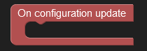
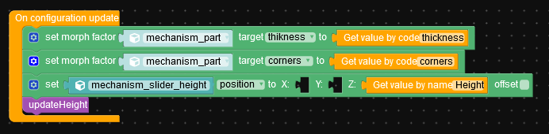
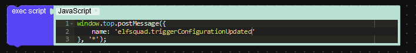
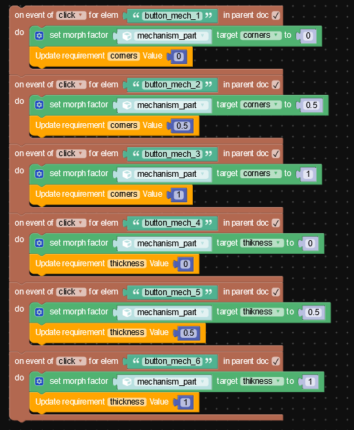

# Elfsquad Verge3d blocks
By using the Elfsquad Verge3d blocks you can easily interact with the Elfsquad showroom.

## Blocks

### Events
#### On configuration update

This block is called when the configuration is updated.

### Actions
#### Get value by code

This block can be used to retrieve the value of a feature by its feature code.

#### Get value by name

This block can be used to retrieve the value of a feature by its feature name.

#### Update requirement by code

This block can be used to update the requirement of a feature by its feature code.

## Getting started
You can refer to the sample post [here](https://docs.elfsquad.io/blog/tutorial%20-%20verge3d%20viewer) for a guide on how to setup this plugin.

## Examples

